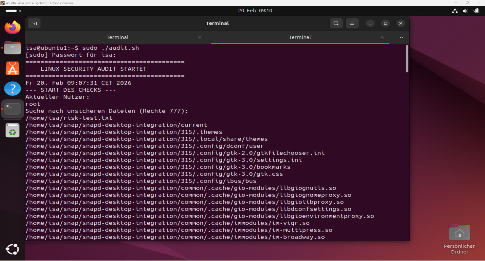
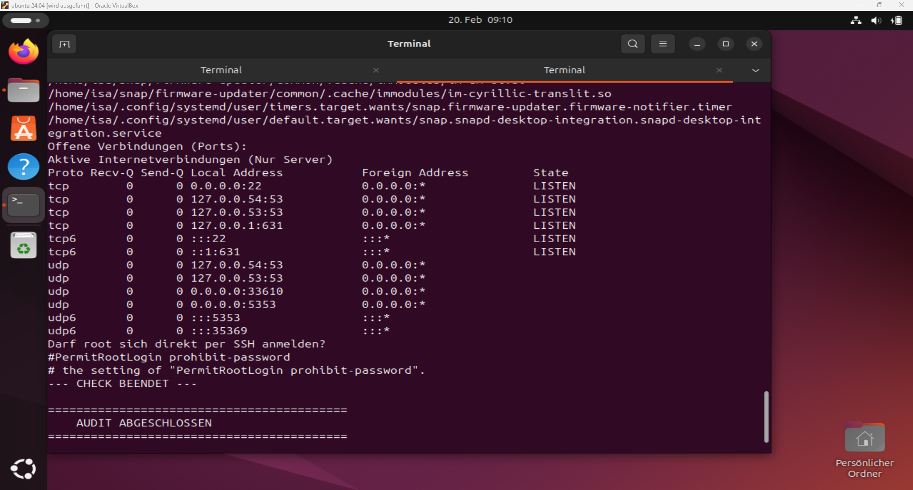

# Mein Audit-Skript - Linux (Automatisierungstool)

Dieses Projekt ist ein **Bash-Skript**, das ich entwickelt habe, um die Grundlagen der **Linux-Administration und Systemsicherheit** zu vertiefen. Ziel war es, ein einfaches Tool zu schaffen, das wichtige Sicherheits-Checks auf einem System automatisch nacheinander ausführt.

---

## Kernfunktionen & was dahintersteckt

### 1. Nutzer-Identifikation (whoami)

Bevor man ein System prüft, muss man wissen, wer man ist. Das Skript zeigt den aktuellen Benutzernamen an.
**Lerneffekt:** Verstehen von Benutzerrechten und dem Unterschied zwischen Standard-Usern und dem Administrator (root).

### 2. Suche nach riskanten Dateirechten (find -perm)

Das Skript sucht im Home-Verzeichnis gezielt nach Dateien, die das Recht 777 haben.
**Was bedeutet -perm 777?** Das ist der „Jeder darf alles“-Modus. Jedes Mitglied im System kann diese Datei lesen, ändern oder löschen.
**Hintergrund:** In einem sicheren System ist das ein massives Risiko. Ich habe gelernt, wie man solche „offenen Scheunentore“ mit einem Befehl findet.

### 3. Netzwerk-Überwachung (netstat -tuln)

Hier listet das Tool alle offenen Ports auf, die gerade „lauschen“ (Listening).

**Die Logik hinter -tuln:**
* **t / u:** Zeigt TCP- und UDP-Verbindungen.
* **l:** Zeigt nur die Ports, die auf „Listen“ (Zuhören) stehen.
* **n:** Zeigt Zahlen statt Namen (z.B. Port 80 statt „http“), was für die technische Analyse präziser ist.

**Sicherheitsfaktor:** Jedes offene Programm im Netzwerk ist ein potenzieller Angriffspunkt. Das Skript macht diese „Türen“ sichtbar.

### 4. SSH-Konfigurations-Check (grep)

Das Skript schaut direkt in die Konfigurationsdatei des SSH-Dienstes.

**Ziel:** Prüfung des Parameters `PermitRootLogin`.

**Wichtigkeit:** Es ist Best Practice, den direkten Root-Login von außen zu verbieten. Mit dem `grep`-Befehl filtert das Skript diese eine wichtige Zeile aus der großen Datei heraus.

---

## Installation & Nutzung

### Voraussetzungen

* Ein Linux-System (z. B. Ubuntu, Debian oder innerhalb einer VM).
* Das Paket `net-tools` (für den `netstat`-Befehl).

### Schnellstart

1. Lade die Datei `audit.sh` herunter.
2. Mache die Datei ausführbar (sonst lässt Linux sie nicht starten):

```bash
chmod +x audit.sh
```

3. Starte das Skript im Terminal:

```bash
./audit.sh
```

---

## Beweis der Funktionalität (Testing)
 
Um sicherzugehen, dass das Skript stabil läuft, habe ich es in einer frischen Ubuntu-VM getestet. 
 



 
**Was man hier sieht:**
* Der **Benutzer-Check** erkennt korrekt, dass das Skript als `root` ausgeführt wird.
* Der **Rechte-Audit** findet meine absichtlich erstellte Test-Datei (`risk-test.txt`).
* Der **Netzwerk-Scan** zeigt alle aktiven Ports an, nachdem ich `net-tools` nachinstalliert habe.
 
---

## Troubleshooting & Learning (Debugging)
 
In der IT läuft selten alles auf Anhieb perfekt – besonders in einer frischen Test-Umgebung. Während der Entwicklung und dem Testlauf in einer Ubuntu-VM sind drei typische Herausforderungen aufgetreten, die ich analysiert und gelöst habe:
 
### 1. Fehlende System-Tools (`netstat` nicht gefunden)
* **Problem:** Das Skript konnte die Netzwerk-Ports nicht auslesen, da `netstat` in modernen Minimal-Installationen oft fehlt.
* **Lösung:** Installation der `net-tools` via:
  ```bash
  sudo apt update && sudo apt install net-tools -y

### 2. Fehlende SSH-Konfiguration
* **Problem:** Die Datei `/etc/ssh/sshd_config` wurde nicht gefunden.
* **Ursache:** Der SSH-Dienst war in der VM noch nicht installiert.
* **Lösung:** Installation des `openssh-server`. Erst dadurch wurde die Konfigurationsdatei erstellt, die mein Skript prüfen wollte.
 
### 3. Syntax-Fehler & Berechtigungen
* **Syntax:** Ein fehlendes Leerzeichen bei einem `echo`-Befehl (`ech====`) führte zu einer Fehlermeldung ("Befehl nicht gefunden"). Dies wurde im Code korrigiert.
* **Rechte:** Da das Skript in Systemdateien liest, wurde mir klar, dass eine Ausführung mit Root-Rechten (`sudo ./audit.sh`) zwingend erforderlich ist.
 
> **Fazit:** Diese Fehler waren extrem wertvoll. Sie haben mir gezeigt, dass ein guter Entwickler nicht nur Code schreiben, sondern auch die Umgebung (VM) verstehen und vorbereiten muss.
 
---

## Roadmap (nächste Schritte)

- [ ] Fehlerbehandlung: Eine Abfrage einbauen, ob netstat überhaupt installiert ist.
- [ ] Bericht-Datei: Die Ergebnisse nicht nur im Terminal anzeigen, sondern in einer .txt Datei speichern.
- [ ] Farb-Code: Wichtige Warnungen (wie gefundene 777-Dateien) rot markieren.

---

## Entwicklungs- und Lernprozess

Schritt 1: Kennenlernen der Bash-Syntax und wie man Skripte mit #!/bin/bash startet.
Schritt 2: Manuelle Befehle im Terminal testen, bevor ich sie in das Skript geschrieben habe.
Schritt 3: Verstehen der numerischen Dateirechte (Chmod-Logik) und wie man sie mit find sucht.
Schritt 4: Strukturierung der Ausgabe, damit ein Administrator die Infos schnell lesen kann.

---

## Über das Projekt

In den ersten Monaten meiner Umschulung zur Fachinformatikerin für Anwendungsentwicklung habe ich gemerkt, wie wichtig es ist, das Betriebssystem unter dem Code zu verstehen.

Dieses Projekt zeigt:

- [x] Meine Sicherheit im Umgang mit der Kommandozeile
- [x] Mein Verständnis für Netzwerk-Grundlagen
- [x] Meinen Willen, Aufgaben durch Automatisierung effizienter zu machen
